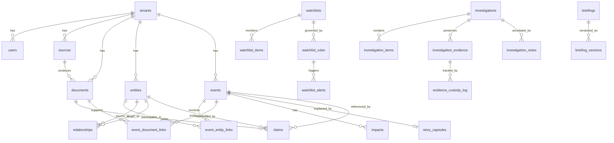

# NARAD V2 — Canonical Ontology and Core Object Model

**Status:** Draft v2 — Session 1 deliverable (revised with best practices)
**Date:** 2026-03-27
**Scope:** Defines every canonical object, its fields, relationships, lifecycle, schema boundary, and read-model projection. This document is the single source of truth for the data layer.
**Skills applied:** postgres-best-practices, database-design, domain-driven-design, cqrs-implementation, architecture-patterns, backend-dev-guidelines

---

## 1. Schema Boundaries

PostgreSQL schemas enforce module boundaries while sharing a single database.

| Schema | Owns | Purpose |
|---|---|---|
| `core` | Source, Document, Entity, Event, Claim, Relationship, Impact, StoryCapsule, Tenant, User | Canonical write model — the only schema that creates real-world objects |
| `workflow` | Watchlist, WatchlistAlert, Investigation, InvestigationItem, InvestigationEvidence, Briefing, BriefingVersion | Analyst workflow objects — reference `core` objects, never copy them |
| `geo_intelligence` | LayerConfig, TileCache metadata | GeoStrat layer registry and tile management |
| `corp_watch` | EntityProfile, FilingTimeline | Enriched corporate projections over `core.entities` |
| `lex_pulse` | RegulatoryEvent, SemanticCache | Regulatory projections and RAG cache |
| `audit` | AuditLog, StateTransition, EvidenceAccess | Immutable audit trail |
| `projections` | PulseBoardFeed, WatchlistDelta, EntitySummary, RegulatoryDigest | Precomputed JSONB read models for CQRS |

**Rule:** Only `core` and `workflow` schemas perform INSERT/UPDATE on canonical objects. All other schemas hold derived/projected data that can be rebuilt from `core`.

---

## 1.5 DDD Strategic Model

### Subdomain Classification

| Subdomain | Type | Bounded Context | Schema |
|---|---|---|---|
| Intelligence Core | **Core** | Canonical objects (Event, Entity, Document, Claim, Relationship) | `core` |
| Analyst Workflows | **Core** | Investigations, Watchlists, Briefings, Alerts | `workflow` |
| Geospatial Intelligence | **Supporting** | Layer configs, tile management, spatial projections | `geo_intelligence` |
| Corporate Intelligence | **Supporting** | Entity profiles, filing timelines, ownership graphs | `corp_watch` |
| Regulatory Intelligence | **Supporting** | Regulatory events, RAG cache, legislative corpus | `lex_pulse` |
| Audit & Compliance | **Generic** | Immutable logs, state transitions, evidence custody | `audit` |
| Read Projections | **Generic** | CQRS materialized views for each workspace | `projections` |

### Aggregate Boundaries and Invariants

Each aggregate is a consistency boundary. Cross-aggregate references use UUIDs, never direct object references.

| Aggregate Root | Children (owned) | Key Invariants |
|---|---|---|
| **Event** | EventEntityLinks, EventDocumentLinks, Impacts, StoryCapsule | severity and confidence must be set; at least one document link required for canonicalized status; source_count >= linked corroborating documents |
| **Entity** | (none — relationships are separate) | canonical_name must not be empty; entity_type is immutable after resolution; external_ids values must be globally unique per key type |
| **Document** | Claims | content_hash must be unique per (source_id, tenant_id); body_text or s3_key must be present (not both NULL) |
| **Investigation** | InvestigationItems, InvestigationEvidence, InvestigationNotes, EvidenceCustodyLog | status transitions follow state machine; evidence_hash must match document content_hash at intake; only owner or admin can transition to 'closed' |
| **Watchlist** | WatchlistItems, WatchlistRules | at least one item or rule required for activation; rules must parse as valid JSON Logic |
| **Briefing** | BriefingVersions | version_number must be monotonically increasing; only 'approved' status can transition to 'published'; supersedes_id must point to a published briefing |

### Ubiquitous Language Glossary

| Term | Definition |
|---|---|
| **Canonical Event** | A deduplicated, normalized real-world incident that is the single source of truth for an occurrence |
| **Story Capsule** | An AI-generated explanatory bundle (headline + explanation + evidence) attached to a canonical event |
| **Entity Resolution** | The process of matching and merging multiple references to the same real-world entity into one canonical record |
| **Trust Tier** | Source classification: Tier 1 = government source-of-record, Tier 2 = structured enrichment, Tier 3 = controlled/licensed |
| **Confidence Score** | 0.00–1.00 numeric expressing certainty. Deterministic matches = 1.00, AI-extracted claims start at model confidence |
| **Lineage Hash** | SHA-256 fingerprint of (source_document + extraction_model + extracted_content) for full provenance tracing |
| **Dark Archive** | WORM-compliant cold storage where erased/redacted content moves to preserve referential integrity |
| **Claim** | A single factual assertion extracted from a document, with provenance and confidence |
| **Projection** | A precomputed, denormalized read model optimized for a specific workspace's query patterns (CQRS) |
| **Verification Gate** | Human review checkpoint where AI-generated insights must be explicitly accepted before becoming canonical |
| **Episode** | A group of related watchlist alerts that represent the same underlying situation |

---

## 2. Shared Conventions

### IDs
- All primary keys: `UUID v7` (time-ordered for index locality, avoids B-tree fragmentation from random UUIDv4)
- Requires `pg_uuidv7` extension: `CREATE EXTENSION pg_uuidv7;`
- External IDs stored in `external_ids JSONB` with GIN index using `jsonb_path_ops` for efficient `@>` containment queries
- All identifiers use lowercase snake_case (Postgres folds unquoted identifiers to lowercase — never use quoted mixed-case)

### Timestamps
- All tables carry `created_at TIMESTAMPTZ NOT NULL DEFAULT now()` and `updated_at TIMESTAMPTZ NOT NULL DEFAULT now()`
- Always `TIMESTAMPTZ`, never `TIMESTAMP` (timezone-aware prevents silent bugs across regions)
- `updated_at` is set by trigger on every UPDATE
- Use `TEXT` not `VARCHAR(n)` for strings — same performance in Postgres, no artificial limits

### Tenancy
- Every row carries `tenant_id UUID NOT NULL REFERENCES core.tenants(id)`
- Row-Level Security (RLS) policies enforce tenant isolation
- All queries pass through `SET app.current_tenant_id = '...'` at connection time
- **RLS performance rule:** Wrap `current_setting()` calls in a subselect so it evaluates once per query, not per row:
  ```sql
  CREATE POLICY tenant_isolation ON core.events
    FOR ALL USING (tenant_id = (SELECT current_setting('app.current_tenant_id')::uuid));
  ```
- Index `tenant_id` on every table (required for RLS policy performance)

### Connection Management
- Use PgBouncer in **transaction mode** between app and Postgres
- Pool size formula: `(CPU cores * 2) + effective_spindle_count` (start with 10-20)
- Set `idle_in_transaction_session_timeout = '30s'` to reclaim leaked connections
- Set `statement_timeout = '30s'` to prevent runaway queries
- Application uses unnamed prepared statements (compatible with transaction-mode pooling)

### Soft Delete
- No soft deletes in `core`. Deletions move to dark archive (see Section 10).
- `workflow` objects use status-based lifecycles instead of deletion.

### Foreign Key Indexing
- **Every FK column must have an explicit index.** Postgres does not auto-index FKs.
- Missing FK indexes cause full table scans on JOINs and CASCADE deletes.
- ON DELETE policy: `RESTRICT` by default (prevent accidental cascade). Use `CASCADE` only on owned children within an aggregate.

### Text Search
- `tsv TSVECTOR` columns on Document, Event, Claim — maintained by trigger
- GIN index on each `tsv` column

### Embeddings
- `embedding vector(768)` on Document, Entity, Event, Claim
- Generated asynchronously by embedding workers, never inline on ingest
- HNSW index via pgvector (`lists = 100`, `probes = 10` as starting config)
- Use **partial index** on embeddings: `WHERE embedding IS NOT NULL` (avoids indexing rows pending async embedding)

### Index Strategy (Postgres Best Practices)
- **Composite indexes:** Equality columns first, range columns last (e.g., `(tenant_id, status, occurred_at DESC)`)
- **Partial indexes:** Use `WHERE` clauses to exclude irrelevant rows (e.g., `WHERE status != 'invalidated'` on events)
- **Covering indexes:** Use `INCLUDE` to avoid heap fetches for frequently selected columns
- **BRIN indexes:** Use on time-series columns in large append-only tables (audit_log, telemetry_events) — 10-100x smaller than B-tree
- **GIN indexes:** For JSONB (`jsonb_path_ops`), arrays, and tsvector columns
- **GIST indexes:** For PostGIS geometry columns
- **Do not over-index:** Write-heavy tables (documents, telemetry) should have minimal indexes; profile before adding

### Partitioning Strategy
- `audit.audit_log`: Range-partition by `created_at` (monthly) — enables instant `DROP TABLE` for old partitions vs slow DELETE
- `core.telemetry_events`: TimescaleDB hypertable (auto-partitioned by time)
- `projections.*`: No partitioning needed (small tables, frequently overwritten)
- Consider partitioning `core.events` and `core.documents` by `created_at` once rows exceed 100M

### Database Roles (Principle of Least Privilege)
```sql
-- Read-only role for Next.js app plane (queries + projections)
CREATE ROLE narad_app_reader NOLOGIN;
GRANT USAGE ON SCHEMA core, projections, geo_intelligence, corp_watch, lex_pulse TO narad_app_reader;
GRANT SELECT ON ALL TABLES IN SCHEMA core, projections, geo_intelligence, corp_watch, lex_pulse TO narad_app_reader;

-- Write role for Python intelligence plane (ingestion + enrichment)
CREATE ROLE narad_ingest_writer NOLOGIN;
GRANT USAGE ON SCHEMA core, audit TO narad_ingest_writer;
GRANT SELECT, INSERT, UPDATE ON ALL TABLES IN SCHEMA core TO narad_ingest_writer;
GRANT INSERT ON ALL TABLES IN SCHEMA audit TO narad_ingest_writer;
-- No DELETE on core — deletions go through dark archive protocol

-- Projection writer for async projection workers
CREATE ROLE narad_projection_writer NOLOGIN;
GRANT USAGE ON SCHEMA projections TO narad_projection_writer;
GRANT SELECT, INSERT, UPDATE, DELETE ON ALL TABLES IN SCHEMA projections TO narad_projection_writer;
GRANT SELECT ON ALL TABLES IN SCHEMA core, workflow TO narad_projection_writer;

-- Login roles inherit from these
CREATE ROLE narad_app LOGIN PASSWORD 'xxx';
GRANT narad_app_reader TO narad_app;

CREATE ROLE narad_worker LOGIN PASSWORD 'xxx';
GRANT narad_ingest_writer TO narad_worker;
GRANT narad_projection_writer TO narad_worker;
```

---

## 3. Core Schema Objects

### 3.1 `core.tenants`

| Column | Type | Constraints | Notes |
|---|---|---|---|
| id | UUID | PK | |
| name | TEXT | NOT NULL | |
| slug | TEXT | UNIQUE NOT NULL | URL-safe identifier |
| config | JSONB | DEFAULT '{}' | Tenant-level feature flags, limits |
| created_at | TIMESTAMPTZ | NOT NULL | |
| updated_at | TIMESTAMPTZ | NOT NULL | |

### 3.2 `core.users`

| Column | Type | Constraints | Notes |
|---|---|---|---|
| id | UUID | PK | |
| tenant_id | UUID | FK → tenants, NOT NULL | |
| email | TEXT | NOT NULL | Unique within tenant |
| display_name | TEXT | NOT NULL | |
| role | TEXT | NOT NULL, CHECK IN ('viewer','analyst','senior_analyst','approver','admin','dpo') | |
| clearance_level | TEXT | NOT NULL DEFAULT 'unclassified', CHECK IN ('unclassified','restricted','confidential','secret') | ABAC gating |
| is_active | BOOLEAN | NOT NULL DEFAULT TRUE | |
| password_hash | TEXT | NOT NULL | bcrypt/argon2 |
| last_login_at | TIMESTAMPTZ | | |
| created_at | TIMESTAMPTZ | NOT NULL | |
| updated_at | TIMESTAMPTZ | NOT NULL | |

**Index:** `UNIQUE (tenant_id, email)`

### 3.3 `core.sources`

Represents a data feed or authority that NARAD ingests from.

| Column | Type | Constraints | Notes |
|---|---|---|---|
| id | UUID | PK | |
| tenant_id | UUID | FK → tenants, NOT NULL | |
| name | TEXT | NOT NULL | Human-readable name, e.g., "PIB RSS" |
| slug | TEXT | NOT NULL | Machine identifier, e.g., "pib_rss" |
| source_type | TEXT | NOT NULL, CHECK IN ('rss','api','portal','wms','sftp','manual','satellite') | |
| trust_tier | SMALLINT | NOT NULL, CHECK IN (1,2,3) | 1=source-of-record, 2=structured enrichment, 3=controlled |
| authority_level | TEXT | NOT NULL | Freeform: "Government of India", "International body", etc. |
| license | TEXT | | e.g., "GODL-India", "CC-BY-4.0" |
| update_cadence_seconds | INTEGER | | Expected refresh interval |
| base_url | TEXT | | |
| config | JSONB | DEFAULT '{}' | Source-specific adapter config |
| governance_approved | BOOLEAN | NOT NULL DEFAULT FALSE | Tier 3 sources require TRUE before ingest |
| is_active | BOOLEAN | NOT NULL DEFAULT TRUE | |
| last_successful_fetch | TIMESTAMPTZ | | |
| last_error | TEXT | | Last failure message for observability |
| created_at | TIMESTAMPTZ | NOT NULL | |
| updated_at | TIMESTAMPTZ | NOT NULL | |

**Index:** `UNIQUE (tenant_id, slug)`

### 3.4 `core.documents`

A single ingested artifact — article, PDF, bulletin, filing, telemetry snapshot, etc.

| Column | Type | Constraints | Notes |
|---|---|---|---|
| id | UUID | PK | |
| tenant_id | UUID | FK → tenants, NOT NULL | |
| source_id | UUID | FK → sources ON DELETE RESTRICT, NOT NULL | Cannot delete a source while documents reference it |
| external_id | TEXT | | Source's own identifier for dedup |
| doc_type | TEXT | NOT NULL, CHECK IN ('article','bulletin','filing','order','warning','forecast','telemetry','debate','bill','gazette','circular','press_release','report','media') | |
| title | TEXT | | |
| body_text | TEXT | | Extracted plain text |
| original_language | TEXT | | ISO 639-1 |
| translated_text | TEXT | | Bhashini output (English canonical) |
| translated_language | TEXT | DEFAULT 'en' | |
| content_hash | TEXT | NOT NULL | SHA-256 of body_text for dedup and integrity |
| fuzzy_hash | TEXT | | ssdeep for media artifacts |
| fetch_url | TEXT | | Original URL |
| s3_key | TEXT | | Object storage path for raw artifact |
| published_at | TIMESTAMPTZ | | When the source published it |
| fetched_at | TIMESTAMPTZ | NOT NULL | When NARAD fetched it |
| embedding | vector(768) | | Async-generated |
| tsv | TSVECTOR | | Auto-maintained by trigger |
| metadata | JSONB | DEFAULT '{}' | Source-specific fields (EXIF, gazette part/section, etc.) |
| created_at | TIMESTAMPTZ | NOT NULL | |
| updated_at | TIMESTAMPTZ | NOT NULL | |

**Indexes:**
- `UNIQUE (tenant_id, source_id, content_hash)` — dedup guard
- `(tenant_id, external_id) WHERE external_id IS NOT NULL` — source-level dedup
- `GIN (tsv)` — full-text search
- `HNSW (embedding vector_cosine_ops)` — semantic search

### 3.5 `core.entities`

A canonical real-world object: company, person, ministry, district, vessel, aircraft, etc.

| Column | Type | Constraints | Notes |
|---|---|---|---|
| id | UUID | PK | |
| tenant_id | UUID | FK → tenants, NOT NULL | |
| entity_type | TEXT | NOT NULL, CHECK IN ('company','person','ministry','regulator','district','state','port','airport','railway_station','nuclear_facility','vessel','aircraft','parcel','project','organization','military_installation') | |
| canonical_name | TEXT | NOT NULL | Best-known name after resolution |
| aliases | TEXT[] | DEFAULT '{}' | All known alternate names |
| description | TEXT | | |
| geometry | GEOMETRY(Point, 4326) | | Primary location |
| state_code | TEXT | | Indian state code |
| district_code | TEXT | | |
| country_code | TEXT | DEFAULT 'IN' | |
| external_ids | JSONB | DEFAULT '{}' | {"cin":"...","isin":"...","icao24":"...","imo":"...","ulpin":"..."} |
| risk_score | NUMERIC(5,2) | | Deterministic composite score (0-100) |
| risk_inputs | JSONB | DEFAULT '{}' | Transparent scoring breakdown |
| health_score | NUMERIC(5,2) | | Entity health/viability (0-100) |
| health_inputs | JSONB | DEFAULT '{}' | |
| is_resolved | BOOLEAN | NOT NULL DEFAULT FALSE | Entity resolution confirmed |
| resolved_at | TIMESTAMPTZ | | |
| resolved_from | UUID[] | DEFAULT '{}' | IDs of merged candidate entities |
| embedding | vector(768) | | |
| tsv | TSVECTOR | | Built from canonical_name + aliases + description |
| metadata | JSONB | DEFAULT '{}' | Type-specific fields |
| created_at | TIMESTAMPTZ | NOT NULL | |
| updated_at | TIMESTAMPTZ | NOT NULL | |

**Indexes:**
- `GIN (aliases)` — alias lookup
- `GIN (external_ids jsonb_path_ops)` — external ID lookup
- `GIST (geometry)` — spatial queries
- `GIN (tsv)` — text search
- `HNSW (embedding vector_cosine_ops)` — semantic search
- `(tenant_id, entity_type)` — filtered scans

### 3.6 `core.events`

A canonical real-world incident, occurrence, or state change.

| Column | Type | Constraints | Notes |
|---|---|---|---|
| id | UUID | PK | |
| tenant_id | UUID | FK → tenants, NOT NULL | |
| event_type | TEXT | NOT NULL, CHECK IN ('conflict','protest','disaster','weather','regulatory','corporate','legislative','infrastructure','security','environment','transport','economic','health','political','judicial','fire','maritime','aviation') | |
| event_subtype | TEXT | | Finer classification |
| title | TEXT | NOT NULL | |
| summary | TEXT | | Human-readable 2-3 sentence summary |
| severity | TEXT | NOT NULL DEFAULT 'medium', CHECK IN ('critical','high','medium','low','informational') | |
| confidence | NUMERIC(3,2) | NOT NULL DEFAULT 0.50, CHECK BETWEEN 0.00 AND 1.00 | |
| status | TEXT | NOT NULL DEFAULT 'ingested', CHECK IN ('ingested','canonicalized','enriched','in_investigation','resolved','invalidated') | |
| geometry | GEOMETRY(Point, 4326) | | |
| geometry_area | GEOMETRY(Polygon, 4326) | | For area-effect events |
| state_code | TEXT | | |
| district_code | TEXT | | |
| occurred_at | TIMESTAMPTZ | | Best estimate of when it happened |
| reported_at | TIMESTAMPTZ | | When first source reported it |
| cluster_id | UUID | | Dedup cluster grouping |
| source_count | INTEGER | NOT NULL DEFAULT 1 | Number of corroborating sources |
| primary_source_id | UUID | FK → sources | Highest-trust source |
| story_capsule_id | UUID | FK → story_capsules | |
| embedding | vector(768) | | |
| tsv | TSVECTOR | | |
| metadata | JSONB | DEFAULT '{}' | |
| created_at | TIMESTAMPTZ | NOT NULL | |
| updated_at | TIMESTAMPTZ | NOT NULL | |

**Indexes:**
- `(tenant_id, status, severity)` — PulseBoard feed queries
- `(tenant_id, occurred_at DESC)` — chronological feed
- `(tenant_id, event_type)` — type-filtered queries
- `GIST (geometry)` — spatial
- `GIST (geometry_area) WHERE geometry_area IS NOT NULL` — area events
- `GIN (tsv)` — text search
- `HNSW (embedding vector_cosine_ops)` — semantic
- `(cluster_id) WHERE cluster_id IS NOT NULL` — cluster lookups

**Lifecycle state machine:**
```
ingested → canonicalized → enriched → in_investigation → resolved
                                    ↘ invalidated
```
Every transition logged in `audit.state_transitions`.

### 3.7 `core.claims`

An extracted factual assertion tied to a document, optionally linked to an entity or event.

| Column | Type | Constraints | Notes |
|---|---|---|---|
| id | UUID | PK | |
| tenant_id | UUID | FK → tenants, NOT NULL | |
| document_id | UUID | FK → documents ON DELETE CASCADE, NOT NULL | Claims are owned by their document (aggregate child) |
| event_id | UUID | FK → events ON DELETE SET NULL | Cross-aggregate reference |
| entity_id | UUID | FK → entities ON DELETE SET NULL | Cross-aggregate reference |
| claim_text | TEXT | NOT NULL | The extracted assertion |
| claim_type | TEXT | NOT NULL, CHECK IN ('factual','opinion','prediction','regulatory','financial','spatial','temporal','causal') | |
| confidence | NUMERIC(3,2) | NOT NULL DEFAULT 0.50 | |
| is_verified | BOOLEAN | NOT NULL DEFAULT FALSE | |
| verified_by | UUID | FK → users | |
| verified_at | TIMESTAMPTZ | | |
| lineage_hash | TEXT | NOT NULL | Hash of (document_id + extraction_model + claim_text) |
| extraction_model | TEXT | | Model that extracted this claim |
| extraction_model_version | TEXT | | |
| embedding | vector(768) | | |
| created_at | TIMESTAMPTZ | NOT NULL | |

**Index:** `(tenant_id, document_id)`, `(tenant_id, event_id) WHERE event_id IS NOT NULL`, `(tenant_id, entity_id) WHERE entity_id IS NOT NULL`

### 3.8 `core.relationships`

Directed, temporal, confidence-scored links between entities.

| Column | Type | Constraints | Notes |
|---|---|---|---|
| id | UUID | PK | |
| tenant_id | UUID | FK → tenants, NOT NULL | |
| source_entity_id | UUID | FK → entities ON DELETE CASCADE, NOT NULL | Relationship dies if either entity is removed |
| target_entity_id | UUID | FK → entities ON DELETE CASCADE, NOT NULL | |
| relationship_type | TEXT | NOT NULL, CHECK IN ('ownership','directorship','subsidiary','parent','partner','supplier','customer','regulator','regulated_by','located_in','operates_at','successor','predecessor','affiliated','joint_venture','legal_action') | |
| confidence | NUMERIC(3,2) | NOT NULL DEFAULT 0.50 | |
| valid_from | TIMESTAMPTZ | | |
| valid_until | TIMESTAMPTZ | | NULL = still active |
| lineage_hash | TEXT | NOT NULL | Provenance fingerprint |
| source_document_id | UUID | FK → documents | Document that established this relationship |
| metadata | JSONB | DEFAULT '{}' | e.g., ownership_percentage, board_position |
| created_at | TIMESTAMPTZ | NOT NULL | |
| updated_at | TIMESTAMPTZ | NOT NULL | |

**Indexes:**
- `(tenant_id, source_entity_id)` — outbound traversal
- `(tenant_id, target_entity_id)` — inbound traversal
- `(tenant_id, relationship_type)` — type-filtered graph queries

**Constraint:** `CHECK (source_entity_id != target_entity_id)`

### 3.9 `core.event_entity_links`

Links an event to the entities involved.

| Column | Type | Constraints | Notes |
|---|---|---|---|
| id | UUID | PK | |
| tenant_id | UUID | FK → tenants, NOT NULL | |
| event_id | UUID | FK → events ON DELETE CASCADE, NOT NULL | Link dies with event (aggregate child) |
| entity_id | UUID | FK → entities ON DELETE CASCADE, NOT NULL | Link dies with entity |
| role | TEXT | NOT NULL, CHECK IN ('actor','target','location','regulator','reporter','affected','mentioned','owner','operator') | |
| confidence | NUMERIC(3,2) | NOT NULL DEFAULT 0.50 | |
| created_at | TIMESTAMPTZ | NOT NULL | |

**Index:** `UNIQUE (tenant_id, event_id, entity_id, role)` — prevent duplicate links

### 3.10 `core.event_document_links`

Links an event to its supporting documents.

| Column | Type | Constraints | Notes |
|---|---|---|---|
| id | UUID | PK | |
| tenant_id | UUID | FK → tenants, NOT NULL | |
| event_id | UUID | FK → events ON DELETE CASCADE, NOT NULL | Link dies with event |
| document_id | UUID | FK → documents ON DELETE RESTRICT, NOT NULL | Cannot delete document while event references it |
| link_type | TEXT | NOT NULL, CHECK IN ('primary_source','corroboration','context','contradiction','update') | |
| created_at | TIMESTAMPTZ | NOT NULL | |

**Index:** `UNIQUE (tenant_id, event_id, document_id, link_type)`

### 3.11 `core.impacts`

Structured impact assessment per event.

| Column | Type | Constraints | Notes |
|---|---|---|---|
| id | UUID | PK | |
| tenant_id | UUID | FK → tenants, NOT NULL | |
| event_id | UUID | FK → events, NOT NULL | |
| impact_type | TEXT | NOT NULL, CHECK IN ('human','economic','legal','infrastructure','environmental','political','social','reputational') | |
| severity | TEXT | NOT NULL, CHECK IN ('critical','high','medium','low') | |
| description | TEXT | | |
| quantitative_value | NUMERIC | | e.g., fatalities count, USD amount |
| quantitative_unit | TEXT | | e.g., "persons", "INR crore", "hectares" |
| confidence | NUMERIC(3,2) | NOT NULL DEFAULT 0.50 | |
| created_at | TIMESTAMPTZ | NOT NULL | |

### 3.12 `core.story_capsules`

AI-generated explanatory bundle for a canonical event.

| Column | Type | Constraints | Notes |
|---|---|---|---|
| id | UUID | PK | |
| tenant_id | UUID | FK → tenants, NOT NULL | |
| event_id | UUID | FK → events, NOT NULL | |
| headline | TEXT | NOT NULL | One-line summary |
| explanation | TEXT | NOT NULL | 3-5 sentence plain-language explanation |
| key_facts | JSONB | DEFAULT '[]' | Array of extracted key points |
| evidence_bundle | JSONB | NOT NULL | Array of {document_id, relevance_score, excerpt} |
| ai_model | TEXT | NOT NULL | e.g., "gemini-2.5-flash" |
| ai_model_version | TEXT | | |
| prompt_hash | TEXT | NOT NULL | Hash of generation prompt for reproducibility |
| confidence | NUMERIC(3,2) | NOT NULL | |
| generated_at | TIMESTAMPTZ | NOT NULL | |
| expires_at | TIMESTAMPTZ | | For cache TTL |
| superseded_by | UUID | FK → story_capsules | |
| created_at | TIMESTAMPTZ | NOT NULL | |

**Index:** `(tenant_id, event_id)` — lookup by event

---

## 4. Workflow Schema Objects

### 4.1 `workflow.watchlists`

| Column | Type | Constraints | Notes |
|---|---|---|---|
| id | UUID | PK | |
| tenant_id | UUID | FK → core.tenants, NOT NULL | |
| owner_id | UUID | FK → core.users, NOT NULL | |
| name | TEXT | NOT NULL | |
| description | TEXT | | |
| is_active | BOOLEAN | NOT NULL DEFAULT TRUE | |
| created_at | TIMESTAMPTZ | NOT NULL | |
| updated_at | TIMESTAMPTZ | NOT NULL | |

### 4.2 `workflow.watchlist_items`

What the watchlist monitors.

| Column | Type | Constraints | Notes |
|---|---|---|---|
| id | UUID | PK | |
| watchlist_id | UUID | FK → watchlists, NOT NULL | |
| target_type | TEXT | NOT NULL, CHECK IN ('entity','event','geography','regulatory_subject','asset','company','ministry','district') | |
| target_id | UUID | NOT NULL | Polymorphic FK to core objects |
| added_by | UUID | FK → core.users, NOT NULL | |
| created_at | TIMESTAMPTZ | NOT NULL | |

**Index:** `UNIQUE (watchlist_id, target_type, target_id)`

### 4.3 `workflow.watchlist_rules`

Declarative alerting rules.

| Column | Type | Constraints | Notes |
|---|---|---|---|
| id | UUID | PK | |
| watchlist_id | UUID | FK → watchlists, NOT NULL | |
| rule_name | TEXT | NOT NULL | |
| condition | JSONB | NOT NULL | Structured rule definition |
| severity_override | TEXT | CHECK IN ('critical','high','medium','low') | Override default severity |
| is_active | BOOLEAN | NOT NULL DEFAULT TRUE | |
| created_at | TIMESTAMPTZ | NOT NULL | |
| updated_at | TIMESTAMPTZ | NOT NULL | |

### 4.4 `workflow.watchlist_alerts`

| Column | Type | Constraints | Notes |
|---|---|---|---|
| id | UUID | PK | |
| tenant_id | UUID | FK → core.tenants, NOT NULL | |
| watchlist_id | UUID | FK → watchlists, NOT NULL | |
| rule_id | UUID | FK → watchlist_rules | |
| triggered_by_event_id | UUID | FK → core.events | |
| triggered_by_entity_id | UUID | FK → core.entities | |
| severity | TEXT | NOT NULL, CHECK IN ('critical','high','medium','low') | |
| status | TEXT | NOT NULL DEFAULT 'new', CHECK IN ('new','triaged','assigned','acknowledged','in_progress','resolved','suppressed') | |
| title | TEXT | NOT NULL | |
| summary | TEXT | | |
| assigned_to | UUID | FK → core.users | |
| episode_id | UUID | | Groups related alerts |
| triaged_at | TIMESTAMPTZ | | |
| resolved_at | TIMESTAMPTZ | | |
| metadata | JSONB | DEFAULT '{}' | |
| created_at | TIMESTAMPTZ | NOT NULL | |
| updated_at | TIMESTAMPTZ | NOT NULL | |

**Lifecycle:**
```
new → triaged → assigned → acknowledged → in_progress → resolved
                                                      ↘ suppressed
```

### 4.5 `workflow.investigations`

| Column | Type | Constraints | Notes |
|---|---|---|---|
| id | UUID | PK | |
| tenant_id | UUID | FK → core.tenants, NOT NULL | |
| owner_id | UUID | FK → core.users, NOT NULL | |
| title | TEXT | NOT NULL | |
| description | TEXT | | |
| status | TEXT | NOT NULL DEFAULT 'draft', CHECK IN ('draft','under_review','active','on_hold','closed','archived') | |
| classification | TEXT | NOT NULL DEFAULT 'unclassified', CHECK IN ('unclassified','restricted','confidential','secret') | |
| confidence | NUMERIC(3,2) | | Overall case confidence |
| hypothesis | TEXT | | Working hypothesis |
| created_at | TIMESTAMPTZ | NOT NULL | |
| updated_at | TIMESTAMPTZ | NOT NULL | |

**Lifecycle:**
```
draft → under_review → active → on_hold → closed → archived
                              ↘ closed (can skip on_hold)
```

### 4.6 `workflow.investigation_items`

Links canonical objects into an investigation.

| Column | Type | Constraints | Notes |
|---|---|---|---|
| id | UUID | PK | |
| investigation_id | UUID | FK → investigations, NOT NULL | |
| item_type | TEXT | NOT NULL, CHECK IN ('event','entity','document','claim') | |
| item_id | UUID | NOT NULL | Polymorphic FK |
| role | TEXT | NOT NULL DEFAULT 'evidence', CHECK IN ('key_evidence','supporting','context','lead','exculpatory','disputed') | |
| added_by | UUID | FK → core.users, NOT NULL | |
| notes | TEXT | | Analyst annotation |
| created_at | TIMESTAMPTZ | NOT NULL | |

### 4.7 `workflow.investigation_evidence`

Digital evidence management — chain-of-custody tracking.

| Column | Type | Constraints | Notes |
|---|---|---|---|
| id | UUID | PK | |
| investigation_id | UUID | FK → investigations, NOT NULL | |
| document_id | UUID | FK → core.documents, NOT NULL | |
| evidence_hash | TEXT | NOT NULL | SHA-256 at time of intake |
| s3_key_worm | TEXT | NOT NULL | WORM-compliant storage path |
| is_verified | BOOLEAN | NOT NULL DEFAULT FALSE | |
| verified_by | UUID | FK → core.users | |
| verified_at | TIMESTAMPTZ | | |
| created_at | TIMESTAMPTZ | NOT NULL | |

### 4.8 `workflow.evidence_custody_log`

Immutable chain-of-custody record.

| Column | Type | Constraints | Notes |
|---|---|---|---|
| id | UUID | PK | |
| evidence_id | UUID | FK → investigation_evidence, NOT NULL | |
| user_id | UUID | FK → core.users, NOT NULL | |
| action | TEXT | NOT NULL, CHECK IN ('ingested','viewed','exported','verified','challenged','transferred') | |
| evidence_hash_at_action | TEXT | NOT NULL | Hash re-verified at action time |
| ip_address | INET | | |
| created_at | TIMESTAMPTZ | NOT NULL | |

**Constraint:** This table is INSERT-only. No UPDATE or DELETE allowed (enforced by RLS policy or trigger).

### 4.9 `workflow.investigation_notes`

Analyst notes and hypotheses within a case.

| Column | Type | Constraints | Notes |
|---|---|---|---|
| id | UUID | PK | |
| investigation_id | UUID | FK → investigations, NOT NULL | |
| author_id | UUID | FK → core.users, NOT NULL | |
| note_type | TEXT | NOT NULL DEFAULT 'note', CHECK IN ('note','hypothesis','task','decision') | |
| body | TEXT | NOT NULL | |
| is_ai_generated | BOOLEAN | NOT NULL DEFAULT FALSE | |
| verification_status | TEXT | DEFAULT 'unverified', CHECK IN ('unverified','pending_review','accepted','rejected') | For AI-generated content |
| created_at | TIMESTAMPTZ | NOT NULL | |
| updated_at | TIMESTAMPTZ | NOT NULL | |

### 4.10 `workflow.briefings`

| Column | Type | Constraints | Notes |
|---|---|---|---|
| id | UUID | PK | |
| tenant_id | UUID | FK → core.tenants, NOT NULL | |
| owner_id | UUID | FK → core.users, NOT NULL | |
| title | TEXT | NOT NULL | |
| audience | TEXT | | Target audience descriptor |
| status | TEXT | NOT NULL DEFAULT 'draft', CHECK IN ('draft','under_review','approved','published','superseded','withdrawn') | |
| current_version | INTEGER | NOT NULL DEFAULT 1 | |
| supersedes_id | UUID | FK → briefings | |
| approved_by | UUID | FK → core.users | |
| approved_at | TIMESTAMPTZ | | |
| published_at | TIMESTAMPTZ | | |
| created_at | TIMESTAMPTZ | NOT NULL | |
| updated_at | TIMESTAMPTZ | NOT NULL | |

**Lifecycle:**
```
draft → under_review → approved → published → superseded
                                             ↘ withdrawn
```

### 4.11 `workflow.briefing_versions`

Immutable version snapshots.

| Column | Type | Constraints | Notes |
|---|---|---|---|
| id | UUID | PK | |
| briefing_id | UUID | FK → briefings, NOT NULL | |
| version_number | INTEGER | NOT NULL | |
| sections | JSONB | NOT NULL | Array of {title, body, source_refs[]} |
| source_investigation_ids | UUID[] | DEFAULT '{}' | |
| source_event_ids | UUID[] | DEFAULT '{}' | |
| source_watchlist_ids | UUID[] | DEFAULT '{}' | |
| ai_draft_model | TEXT | | Model used for initial draft |
| edited_by | UUID | FK → core.users, NOT NULL | |
| created_at | TIMESTAMPTZ | NOT NULL | |

**Index:** `UNIQUE (briefing_id, version_number)`

---

## 5. Domain-Specific Schema Objects

### 5.1 `corp_watch.entity_profiles`

Enriched corporate data over `core.entities`.

| Column | Type | Constraints | Notes |
|---|---|---|---|
| id | UUID | PK | |
| entity_id | UUID | FK → core.entities, NOT NULL, UNIQUE | |
| incorporation_date | DATE | | |
| registered_office | TEXT | | |
| authorized_capital_inr | NUMERIC | | |
| paid_up_capital_inr | NUMERIC | | |
| company_status | TEXT | | Active, Strike Off, etc. |
| company_class | TEXT | | Private, Public, OPC, etc. |
| listing_status | TEXT | | Listed, Unlisted |
| sector | TEXT | | |
| filing_completeness | NUMERIC(3,2) | | 0.00–1.00 |
| last_filing_date | DATE | | |
| directors | JSONB | DEFAULT '[]' | Array of {name, din, designation, appointment_date} |
| shareholders | JSONB | DEFAULT '[]' | Array of {name, percentage, category} |
| compliance_breach_count | INTEGER | DEFAULT 0 | |
| created_at | TIMESTAMPTZ | NOT NULL | |
| updated_at | TIMESTAMPTZ | NOT NULL | |

### 5.2 `lex_pulse.regulatory_events`

Projection of regulatory/legislative events with structured fields.

| Column | Type | Constraints | Notes |
|---|---|---|---|
| id | UUID | PK | |
| event_id | UUID | FK → core.events, NOT NULL, UNIQUE | |
| ministry | TEXT | | |
| regulator | TEXT | | |
| gazette_ref | TEXT | | Part/section/number |
| act_ref | TEXT | | Referenced act |
| amendment_type | TEXT | CHECK IN ('new_act','amendment','repeal','notification','circular','order','rule','guideline') | |
| effective_date | DATE | | |
| what_changed | TEXT | | Plain-language delta |
| why_it_matters | TEXT | | Analyst/AI impact summary |
| affected_sectors | TEXT[] | DEFAULT '{}' | |
| created_at | TIMESTAMPTZ | NOT NULL | |
| updated_at | TIMESTAMPTZ | NOT NULL | |

### 5.3 `lex_pulse.semantic_cache`

RAG answer cache to avoid redundant LLM calls.

| Column | Type | Constraints | Notes |
|---|---|---|---|
| id | UUID | PK | |
| tenant_id | UUID | FK → core.tenants, NOT NULL | |
| query_text | TEXT | NOT NULL | Original user query |
| query_embedding | vector(768) | NOT NULL | |
| answer_text | TEXT | NOT NULL | |
| citations | JSONB | NOT NULL | Array of {document_id, excerpt, relevance} |
| model_used | TEXT | NOT NULL | |
| hit_count | INTEGER | NOT NULL DEFAULT 0 | |
| created_at | TIMESTAMPTZ | NOT NULL | |
| expires_at | TIMESTAMPTZ | NOT NULL | TTL = RAG_CACHE_TTL_SECONDS |

**Index:** `HNSW (query_embedding vector_cosine_ops)` — similarity lookup for cache hits

### 5.4 `geo_intelligence.layer_configs`

Registry of map layers and their preset assignments.

| Column | Type | Constraints | Notes |
|---|---|---|---|
| id | UUID | PK | |
| tenant_id | UUID | FK → core.tenants, NOT NULL | |
| name | TEXT | NOT NULL | |
| slug | TEXT | NOT NULL | |
| layer_type | TEXT | NOT NULL, CHECK IN ('point','polygon','heatmap','movement','cluster','choropleth','tile_overlay') | |
| presets | TEXT[] | NOT NULL | Which GeoStrat presets include this layer |
| data_query | TEXT | | SQL or query spec for dynamic layers |
| tile_url_template | TEXT | | For MVT/PMTiles layers |
| style_config | JSONB | NOT NULL DEFAULT '{}' | MapLibre style spec fragment |
| min_zoom | SMALLINT | DEFAULT 0 | |
| max_zoom | SMALLINT | DEFAULT 18 | |
| refresh_interval_seconds | INTEGER | | |
| is_active | BOOLEAN | NOT NULL DEFAULT TRUE | |
| created_at | TIMESTAMPTZ | NOT NULL | |
| updated_at | TIMESTAMPTZ | NOT NULL | |

---

## 6. Audit Schema Objects

### 6.1 `audit.audit_log`

| Column | Type | Constraints | Notes |
|---|---|---|---|
| id | UUID | PK | |
| tenant_id | UUID | NOT NULL | |
| user_id | UUID | NOT NULL | |
| action | TEXT | NOT NULL | e.g., "create", "update", "delete", "export", "view_evidence" |
| object_type | TEXT | NOT NULL | e.g., "event", "investigation", "briefing" |
| object_id | UUID | NOT NULL | |
| delta | JSONB | | Changed fields only: {field: {old, new}} |
| ip_address | INET | | |
| user_agent | TEXT | | |
| created_at | TIMESTAMPTZ | NOT NULL | |

**Partitioning:** Range-partition by `created_at` (monthly) — enables instant `DROP TABLE` for old partitions vs slow DELETE.
**Index:** BRIN on `created_at` (10-100x smaller than B-tree for append-only time-series data).
**Constraint:** INSERT-only — no UPDATE or DELETE. Enforced via REVOKE UPDATE, DELETE on the table for all roles except superuser.

### 6.2 `audit.state_transitions`

| Column | Type | Constraints | Notes |
|---|---|---|---|
| id | UUID | PK | |
| tenant_id | UUID | NOT NULL | |
| object_type | TEXT | NOT NULL | |
| object_id | UUID | NOT NULL | |
| from_state | TEXT | | NULL for initial creation |
| to_state | TEXT | NOT NULL | |
| transitioned_by | UUID | NOT NULL | |
| reason | TEXT | | |
| created_at | TIMESTAMPTZ | NOT NULL | |

**Constraint:** INSERT-only.

---

## 7. CQRS Read-Model Projections

These are precomputed JSONB tables in the `projections` schema, updated asynchronously when write-model events occur. They power the hot-path UI queries.

### 7.1 `projections.pulseboard_feed`

One row per canonical event, optimized for the PulseBoard card stream.

| Column | Type | Constraints | Notes |
|---|---|---|---|
| event_id | UUID | PK, FK → core.events | |
| tenant_id | UUID | NOT NULL | |
| card | JSONB | NOT NULL | Pre-assembled card payload (see below) |
| severity_rank | SMALLINT | NOT NULL | Numeric for sort: 1=critical, 4=informational |
| occurred_at | TIMESTAMPTZ | NOT NULL | |
| projected_at | TIMESTAMPTZ | NOT NULL | When this projection was last computed |

**Card JSONB structure:**
```json
{
  "title": "...",
  "summary": "...",
  "severity": "high",
  "confidence": 0.87,
  "source_trust_tier": 1,
  "source_count": 3,
  "place": {"state": "Maharashtra", "district": "Mumbai", "lat": 19.07, "lng": 72.87},
  "occurred_at": "2026-03-26T10:00:00Z",
  "event_type": "corporate",
  "linked_entity_ids": ["uuid1", "uuid2"],
  "linked_entity_names": ["Adani Ports", "SEBI"],
  "story_capsule": {"headline": "...", "explanation": "..."},
  "has_evidence": true
}
```

**Indexes:** `(tenant_id, severity_rank, occurred_at DESC)` — default feed sort

**Refresh trigger:** On event INSERT/UPDATE, on story_capsule generation.

### 7.2 `projections.watchlist_deltas`

Change feed per watchlist.

| Column | Type | Constraints | Notes |
|---|---|---|---|
| id | UUID | PK | |
| tenant_id | UUID | NOT NULL | |
| watchlist_id | UUID | FK → workflow.watchlists, NOT NULL | |
| delta_type | TEXT | NOT NULL | e.g., "new_event", "entity_score_change", "alert_triggered" |
| summary | TEXT | NOT NULL | |
| reference_id | UUID | NOT NULL | Event/entity/alert ID |
| reference_type | TEXT | NOT NULL | |
| computed_at | TIMESTAMPTZ | NOT NULL | |

### 7.3 `projections.entity_summaries`

Pre-assembled entity mini-profiles for CorpWatch and slide-over panels.

| Column | Type | Constraints | Notes |
|---|---|---|---|
| entity_id | UUID | PK, FK → core.entities | |
| tenant_id | UUID | NOT NULL | |
| summary | JSONB | NOT NULL | Pre-assembled profile |
| projected_at | TIMESTAMPTZ | NOT NULL | |

**Summary JSONB structure:**
```json
{
  "canonical_name": "...",
  "entity_type": "company",
  "risk_score": 72.5,
  "health_score": 45.0,
  "state": "Maharashtra",
  "recent_event_count_30d": 12,
  "recent_events": [{"id": "...", "title": "...", "severity": "high", "occurred_at": "..."}],
  "relationship_count": 8,
  "key_relationships": [{"target_name": "...", "type": "subsidiary"}],
  "filing_status": "compliant",
  "last_filing_date": "2026-01-15"
}
```

### 7.4 `projections.regulatory_digest`

Pre-assembled regulatory change feed for LexPulse.

| Column | Type | Constraints | Notes |
|---|---|---|---|
| event_id | UUID | PK | |
| tenant_id | UUID | NOT NULL | |
| digest | JSONB | NOT NULL | |
| effective_date | DATE | | For chronological sort |
| projected_at | TIMESTAMPTZ | NOT NULL | |

### 7.5 Projection Refresh Strategy

| Projection | Trigger | Max Staleness |
|---|---|---|
| pulseboard_feed | Event write, story capsule generation | 500ms (FEED_PROJECTION_BATCH_MS) |
| watchlist_deltas | Event write, entity update, alert generation | 1s |
| entity_summaries | Entity update, relationship change, event link | 5s |
| regulatory_digest | Regulatory event write | 5s |

Projections are updated via async workers listening on a PostgreSQL NOTIFY channel or Redis pub/sub. They are idempotent — re-projection of the same event ID overwrites the previous row.

### 7.6 CQRS Command/Query Separation (Architecture Pattern)

NARAD uses CQRS to separate write-heavy ingestion from read-heavy UI serving.

**Write side (Commands)** — handled by Python FastAPI/Celery workers:
- `IngestDocument` — fetch, parse, store in `core.documents`
- `ExtractClaims` — run NLP/LLM, store in `core.claims`
- `CanonicalizeEvent` — cluster, dedup, create/update `core.events`
- `ResolveEntity` — match and merge into `core.entities`
- `GenerateStoryCapsule` — LLM synthesis, store in `core.story_capsules`
- `EvaluateWatchlistRules` — check rules, create `workflow.watchlist_alerts`
- `TransitionState` — advance event/investigation/briefing state machines

Each command handler validates invariants, persists to the write model, then emits a domain event (via `pg_notify` or Redis pub/sub) that triggers projection updates.

**Read side (Queries)** — served by Next.js API routes from `projections` schema:
- `GetPulseBoardFeed(tenant_id, filters, cursor)` → reads `projections.pulseboard_feed`
- `GetEntitySummary(entity_id)` → reads `projections.entity_summaries`
- `GetRegulatoryDigest(tenant_id, filters)` → reads `projections.regulatory_digest`
- `GetWatchlistDeltas(watchlist_id)` → reads `projections.watchlist_deltas`
- `SearchEvents(query, filters)` → hybrid BM25 + vector on `core.events` (direct read, not projected)
- `GetEventDetail(event_id)` → direct join on `core.events` + story_capsule + entity_links

**Consistency model:** Projections are **eventually consistent** (max staleness per table above). The UI shows a "refreshing" indicator when a write is acknowledged but the projection hasn't caught up yet.

### 7.7 Projection Rebuild Strategy

All projections must be rebuildable from canonical tables. This is critical for:
- Schema migrations that change projection shape
- Bug fixes in projection logic
- Disaster recovery

**Rebuild protocol:**
1. Create new projection table with `_v2` suffix
2. Run full rebuild from canonical source (batched, using cursor-based pagination — never OFFSET)
3. Validate row counts and spot-check JSONB integrity
4. Swap table names in a single transaction (`ALTER TABLE ... RENAME`)
5. Drop old table

**Estimated rebuild times** (to be profiled):
- `pulseboard_feed`: ~1 min per 100K events
- `entity_summaries`: ~2 min per 100K entities
- `regulatory_digest`: ~30s per 50K events

### 7.8 Data Access Patterns (Postgres Best Practices)

- **Batch INSERTs:** Ingestion workers use multi-row INSERT (50-100 rows per statement) for documents and claims
- **UPSERT:** Projections use `INSERT ... ON CONFLICT (event_id) DO UPDATE` for idempotent refresh
- **Cursor-based pagination:** All list APIs use `WHERE (occurred_at, id) < ($cursor_time, $cursor_id) ORDER BY occurred_at DESC, id DESC LIMIT $page_size` — never use OFFSET
- **SKIP LOCKED:** Celery-managed job queues in Postgres use `SELECT ... FOR UPDATE SKIP LOCKED` for non-blocking queue processing
- **Short transactions:** Write operations complete in <100ms. No external API calls inside transactions. LLM calls happen outside the transaction boundary, results written in a separate short transaction.
- **Batch embedding:** Embedding workers process in batches of `EMBED_BATCH_SIZE` (default 50), using `UPDATE ... WHERE id = ANY($1::uuid[])` to set embeddings in one statement

---

## 8. Entity Resolution Rules

### 8.1 Deterministic matching (high confidence)

Match on any unique external ID:

| Entity Type | External ID Key | Source |
|---|---|---|
| company | `cin` | MCA21 |
| company | `isin` | BSE/NSE |
| aircraft | `icao24` | OpenSky |
| vessel | `imo` | AIS/IPA |
| land parcel | `ulpin` | DILRMP |
| airport | `icao_code` / `iata_code` | AAI eAIP |
| port | `port_code` | IPA |
| nuclear facility | `iaea_id` | IAEA |

Deterministic matches produce `confidence = 1.00` and auto-resolve.

### 8.2 Probabilistic matching (needs confirmation)

For entities without unique external IDs:

1. **Name similarity:** Trigram similarity (`pg_trgm`) on `canonical_name` against `aliases[]` — threshold >= 0.7
2. **Type match:** `entity_type` must be identical
3. **Spatial proximity:** If both have geometry, distance < 10km boosts score
4. **Source overlap:** Entities from the same high-trust source are more likely the same
5. **Temporal co-occurrence:** Entities appearing in the same event context boost merge probability

Probabilistic matches produce a candidate pair with a composite score. Pairs scoring >= 0.85 are auto-merged. Pairs scoring 0.60–0.85 are flagged for human review.

### 8.3 Merge strategy

- **Canonical name:** Highest trust-tier source wins
- **Aliases:** Union of all aliases from merged entities
- **External IDs:** Union (conflict = flag for review)
- **Geometry:** Highest trust-tier source wins
- **Metadata:** Deep merge with trust-tier precedence
- **Resolved from:** Store all merged entity UUIDs in `resolved_from[]`
- **All FK references** (event_entity_links, relationships, claims) are updated to point to the surviving entity ID

---

## 9. Event Deduplication and Clustering

### 9.1 Clustering criteria

Two events are candidate duplicates if ALL of:
1. **Temporal proximity:** `occurred_at` within 24 hours
2. **Spatial proximity:** Distance between geometries < 50km (configurable per event_type)
3. **Type match:** Same `event_type`

AND at least ONE of:
4. **Semantic similarity:** Embedding cosine similarity > 0.85
5. **Entity overlap:** Share at least one linked entity
6. **Title similarity:** Trigram similarity > 0.7

### 9.2 Canonical event selection

Within a cluster:
1. Event from highest trust-tier source becomes the **canonical event**
2. Other events become **corroborating sources** (linked via `event_document_links` with `link_type = 'corroboration'`)
3. `source_count` on canonical event is incremented
4. All events in cluster share the same `cluster_id`

### 9.3 Contradiction handling

If a new source contradicts an existing canonical event:
- Link with `link_type = 'contradiction'`
- Reduce `confidence` on the canonical event
- Flag for analyst review if confidence drops below 0.50
- Never auto-invalidate a Tier 1 sourced event based on Tier 2/3 contradiction

---

## 10. Dark Archive Protocol

When data must be erased (DPDPA right to erasure, source takedown, etc.):

1. Move the full document/artifact to `S3_BUCKET_DARK_ARCHIVE`
2. Replace `body_text` and `translated_text` in `core.documents` with `NULL`
3. Replace `s3_key` with the dark archive key (access-controlled)
4. Retain: `content_hash`, `doc_type`, `source_id`, `fetched_at`, `metadata` (anonymized)
5. Mark linked claims with `is_redacted = TRUE` (field not shown above — to be added if needed)
6. Log the erasure action in `audit.audit_log`

This preserves referential integrity (events still reference the document ID) while removing the content.

---

## 11. TimescaleDB Hypertables

High-velocity telemetry data uses TimescaleDB hypertables with automatic retention.

### 11.1 `core.telemetry_events` (hypertable)

For OpenSky aircraft positions, NASA FIRMS fire detections, etc.

| Column | Type | Constraints | Notes |
|---|---|---|---|
| time | TIMESTAMPTZ | NOT NULL | Hypertable partition key |
| tenant_id | UUID | NOT NULL | |
| source_id | UUID | FK → core.sources, NOT NULL | |
| telemetry_type | TEXT | NOT NULL | "aircraft_position", "fire_detection", etc. |
| geometry | GEOMETRY(Point, 4326) | NOT NULL | |
| payload | JSONB | NOT NULL | Source-specific data |

**Retention policy:** `SELECT add_retention_policy('core.telemetry_events', INTERVAL '7 days')`
**Continuous aggregate:** Hourly/daily rollups for historical views.
**Compression:** After 1 day, enable TimescaleDB compression.

---

## 12. Relationship Diagram (Mermaid)



---

## 12.5 Monitoring and Diagnostics (Postgres Best Practices)

### Required Extensions
```sql
CREATE EXTENSION pg_stat_statements;  -- Query performance analysis
CREATE EXTENSION pg_uuidv7;           -- Time-ordered UUIDs
CREATE EXTENSION postgis;             -- Spatial types and functions
CREATE EXTENSION timescaledb;         -- Hypertables and retention
CREATE EXTENSION vector;              -- pgvector for embeddings
CREATE EXTENSION pg_trgm;             -- Trigram similarity for entity resolution
```

### Query Performance Monitoring
- Enable `pg_stat_statements` to track slow queries and their frequency
- Set `log_min_duration_statement = 500` to log queries slower than 500ms
- Run `EXPLAIN ANALYZE` on all query patterns during development — verify index usage before production
- Monitor `pg_stat_user_tables` for sequential scan ratios — any hot-path table with >5% seq scans needs index review

### VACUUM and Statistics
- `autovacuum` must be tuned for write-heavy tables (documents, claims, telemetry):
  - `autovacuum_vacuum_scale_factor = 0.01` (vacuum after 1% of rows change, not default 20%)
  - `autovacuum_analyze_scale_factor = 0.005` (update statistics more frequently)
- Run `ANALYZE` after bulk ingestion operations to ensure query planner has fresh statistics

### Health Checks
- Connection count: `SELECT count(*), state FROM pg_stat_activity GROUP BY state;`
- Bloat detection: Monitor dead tuple ratio via `pg_stat_user_tables`
- Lock contention: `SELECT * FROM pg_locks WHERE NOT granted;`
- Replication lag (if replicas added): `SELECT now() - pg_last_xact_replay_timestamp();`

---

## 13. Open Questions

| # | Question | Impact | Suggested Default |
|---|---|---|---|
| OQ-1 | Should `entity_type` be an extensible lookup table or a fixed CHECK constraint? Extensible allows new types without migration but loses DB-level validation. | Entity model | Start with CHECK constraint; migrate to lookup table if types exceed ~20 |
| OQ-2 | Should investigation items use a true polymorphic FK (with a `TRIGGER` validating existence) or separate nullable FK columns per type? | Investigation model | Polymorphic + trigger — cleaner than 4 nullable FKs |
| OQ-3 | What is the target embedding model dimension? The PRD says Gemini `text-embedding-004` (768d), but if we switch to OpenAI `text-embedding-3-small` (1536d) we need to decide now. | All vector columns | Lock to 768d for Gemini; add migration path doc if switching |
| OQ-4 | Should `watchlist_rules.condition` use a custom DSL or a standard format (e.g., JSON Logic, CEL)? | Watchlist engine | JSON Logic — well-documented, evaluatable in both Python and JS |
| OQ-5 | Do we need a separate `geography` table (districts, states, regions with boundaries) or can we rely on `entities` with `entity_type = 'district'`? | GeoStrat, all spatial queries | Use entities — districts/states are entities with polygon geometry in `metadata` or a separate `geometry_area` column |
| OQ-6 | Should briefing sections be stored as JSONB arrays (current design) or as a separate `briefing_sections` table for fine-grained editing? | Briefing collaboration | JSONB for V2; migrate to table if collaborative editing requires section-level locking |
| OQ-7 | DPDPA requires data minimization — should we implement field-level encryption for PII fields (e.g., person names, contact info) at rest? | Security, compliance | Yes, but Phase 2. Identify PII fields now, encrypt later with pgcrypto or app-layer encryption |
| OQ-8 | What granularity for telemetry rollups? Hourly for 30 days, daily for 1 year, then purge? | TimescaleDB retention | Hourly for 30d, daily for 365d — confirm with PRD stakeholders |
| OQ-9 | Should the Python intelligence plane use a Command Bus pattern (explicit command objects + handlers) or simpler Celery task functions? Command Bus is more testable but adds abstraction. | Backend architecture | Start with Celery tasks that follow command naming conventions; refactor to formal Command Bus if >20 command types |
| OQ-10 | Should projections use PostgreSQL `NOTIFY/LISTEN` or Redis pub/sub for change propagation? NOTIFY is simpler but doesn't survive PgBouncer in transaction mode. | CQRS sync | Redis pub/sub — more reliable with connection pooling, supports fan-out to multiple projection workers |
| OQ-11 | Do we need an ORM (SQLAlchemy, Drizzle) or raw SQL with query builders? ORM adds convenience but obscures query performance. | Both planes | Python: raw SQL with asyncpg (performance-critical ingestion). Next.js: Drizzle ORM (type-safe, lightweight, good with projections) |
| OQ-12 | Should we use PostgreSQL advisory locks or Redis-based distributed locks for entity resolution merge operations? | Concurrency | PostgreSQL advisory locks — co-located with the data, no extra infrastructure |

---

## 14. What Comes Next

This ontology feeds directly into:
- **Session 2:** PostgreSQL migration files (SQL DDL) implementing these schemas
- **Session 3:** Monorepo folder structure and backend scaffolding
- **Session 4:** API contract design per workspace (based on read projections)
- **Session 5:** Frontend shell with routing and shared state primitives
